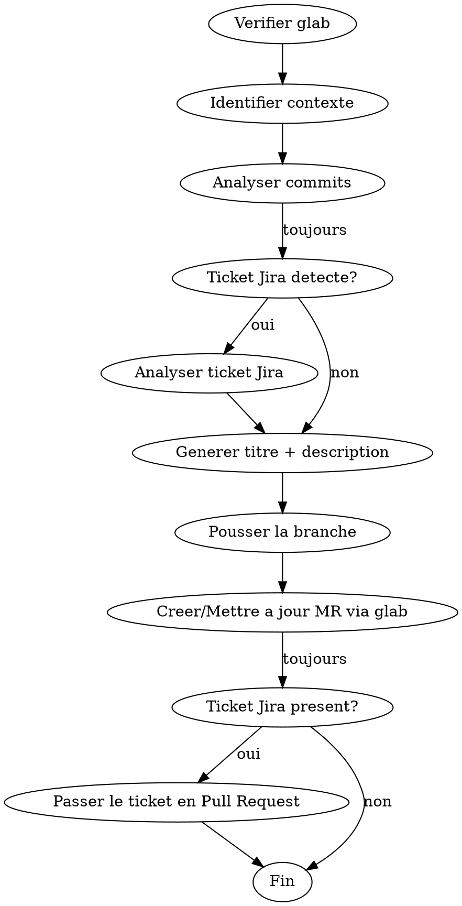

# Create Merge Request

Analyse les commits de la branche courante et cree une merge request GitLab avec une description concise en francais.

**IMPORTANT** : toujours utiliser `/usr/bin/git` (chemin absolu) et jamais `git` nu pour toutes les commandes git de ce skill. Un proxy CLI (rtk) peut intercepter `git` et tronquer la sortie, ce qui fait perdre des informations critiques (fichiers, variables d'env, environnements).

## Workflow



### 0. Verifier les prerequis

Avant toute chose, verifier que `glab` est installe et que l'utilisateur est authentifie :

```bash
which glab || echo "NOT_INSTALLED"
glab auth status 2>&1 || echo "NOT_AUTHENTICATED"
```

- **Si `glab` n'est pas installe** : arreter et demander a l'utilisateur de l'installer (`brew install glab` sur macOS).
- **Si pas authentifie** : arreter et demander a l'utilisateur de s'authentifier en tapant `! glab auth login` dans le prompt.

Ne continuer que si les deux verifications passent.

### 1. Identifier le contexte

```bash
/usr/bin/git branch --show-current           # branche source
/usr/bin/git remote get-url origin           # extraire le project path
/usr/bin/git log trunk..HEAD --oneline       # vérifier qu'il y a des commits
```

**Extraire le project path** depuis l'URL remote :
- `git@gitlab.com:group/sub/project.git` → `group/sub/project`
- `https://gitlab.com/group/sub/project.git` → `group/sub/project`

**Branche cible** : toujours `trunk`, sauf si l'utilisateur specifie une autre branche.

**Prefixes de branche autorises** : `feature/`, `fix/`, `hotfix/` uniquement.
Si la branche courante n'utilise pas un de ces prefixes, la renommer avant de continuer :

1. Determiner le prefixe adapte d'apres les commits. Ne jamais demander confirmation, choisir directement :
   - Commits majoritairement `feat`, `refactor`, `chore`, `docs`, `test`, `perf`, `style` → `feature/`
   - Commits majoritairement `fix` → `fix/`
   - Branche qui cible un correctif urgent en production → `hotfix/`
2. Renommer :
```bash
/usr/bin/git branch -m <ancien-nom> <nouveau-nom>    # renommer localement
/usr/bin/git push origin :<ancien-nom> || true        # supprimer l'ancienne branche remote si elle existe
/usr/bin/git push -u origin <nouveau-nom>             # pousser le nouveau nom
```
3. Continuer le workflow avec le nouveau nom.

### 1b. Verifier qu'une MR n'existe pas deja

```bash
glab mr list --source-branch="<branch>"
```

- **Si une MR existe deja** : mettre a jour son titre et sa description avec les valeurs generees via `glab mr update`. Ne jamais creer de doublon. Ne pas demander confirmation.
- **Si aucune MR** : continuer le workflow et en creer une nouvelle.

### 2. Analyser les commits

```bash
/usr/bin/git log trunk..HEAD --format="%s"   # titres des commits
/usr/bin/git diff trunk...HEAD --stat        # fichiers modifies (vue globale)
```

Lire aussi le diff pour comprendre ce qui change reellement (les titres de commits ne suffisent pas) :

```bash
/usr/bin/git diff trunk...HEAD                # diff complet pour comprendre le fond des changements
```

#### 2a. Comprendre le mecanisme avant de decrire

**Comprendre comment un changement fonctionne pour etre precis, mais ne PAS decrire le mecanisme dans la MR.**

Apres avoir lu le diff, repondre **mentalement** a ces questions (pour soi, pas pour la description) :
1. **Quel est le mecanisme d'activation ?** — Variable, flag, config, appel explicite ?
2. **Quelles sont les valeurs par defaut ?** — Ne pas confondre les contextes.
3. **Qui est impacte ?** — Automatique ou action explicite ?

Ces reponses servent a **eviter les erreurs factuelles** dans le resume, pas a ecrire des bullets techniques. Le resume doit rester au niveau intention/produit. Le reviewer lira le diff pour les details.

#### 2b. Classifier les changements

Identifier :
- Les changements qui ont un **impact fonctionnel** (changement d'URL, de comportement, de config)
- Les changements purement structurels (refacto, extraction, renommage)
- Prioriser : l'impact fonctionnel d'abord, le structurel ensuite

**Lire les conditions avant d'affirmer quoi que ce soit** : si une validation, une contrainte ou un comportement est conditionnel (ex: `if: -> { !brouillon? }`, `unless draft?`, `when: :published`, ancre YAML, `ARG` avec defaut), ne pas l'affirmer de façon absolue dans la description. Décrire la portée réelle du changement. Exemple : ne pas écrire "obligatoire sur les factures et devis" si la validation ne s'applique qu'aux non-brouillon.

### 2b. Analyser le ticket Jira (si present)

**Detecter le ticket** : chercher un pattern de type `[A-Z]+-\d+` (ex: `GCO-850`, `PROJ-123`) dans :
1. Le nom de la branche (prioritaire)
2. Les messages de commit

**Si un ticket est detecte**, utiliser le MCP Atlassian pour recuperer les details :

```
mcp__plugin_atlassian_atlassian__getJiraIssue(issueIdOrKey: "<TICKET_ID>")
```

Extraire du ticket Jira :
- **Le titre du ticket** : pour comprendre l'intention metier
- **La description** : pour le contexte fonctionnel et les criteres d'acceptance
- **Le type** (bug, story, task) : pour calibrer le prefixe Conventional Commits (`fix` pour bug, `feat` pour story/task)
- **Les labels/composants** : pour le scope du commit si pertinent

**Comment utiliser ces informations** :
- Le titre et la description Jira fournissent le **pourquoi metier** — les utiliser pour ecrire un resume oriente intention plutot que technique
- Si la description Jira contient des criteres d'acceptance, verifier que le diff les couvre et le mentionner dans le resume
- Le type Jira aide a choisir le bon prefixe : un ticket bug → `fix(...)`, une story → `feat(...)`
- Ne PAS copier-coller le texte Jira — synthetiser l'information pertinente

**Si le MCP Atlassian n'est pas disponible** (erreur, timeout, non connecte) : ignorer silencieusement et continuer avec les informations des commits et du diff uniquement. Ne jamais bloquer la creation de la MR pour cette raison.

### 3. Generer titre et description

**Titre** : court, < 72 chars, format Conventional Commits.
Le titre doit etre direct et concis : nommer le changement important + mentionner brievement les changements secondaires avec `+ refacto`, `+ fix`, etc.
Exemple : `refactor(slack): Changement webhooks slack + refacto`
Ne pas reformuler le commit message ni le nom de branche — synthetiser l'impact reel apres avoir lu le diff et le ticket Jira (si disponible).
Extraire le ticket Jira/GitLab du nom de branche si present (ex: `feat/PROJ-123-description`).
Ajouter le ticket entre crochets a la fin du titre si present (ex: `feat(sale): clauses de retard [GCO-850]`).

**Description** : suivre le template ci-dessous **a la lettre**.

### 4. Pousser et creer/mettre a jour la MR

```bash
/usr/bin/git push -u origin <branch>        # toujours verifier que la branche est poussee
```

**Creer une nouvelle MR** :
```bash
glab mr create \
  --title "<titre>" \
  --description "$(cat <<'EOF'
<description generee>
EOF
)" \
  --target-branch trunk \
  --assignee @me
```

**Mettre a jour une MR existante** :
```bash
glab mr update <iid> \
  --title "<titre>" \
  --description "$(cat <<'EOF'
<description generee>
EOF
)"
```

Ne PAS forcer `--remove-source-branch`, `--squash`, ou d'autres options — laisser les parametres par defaut du projet GitLab.

### 5. Passer le ticket Jira en "Pull Request" (si present)

**Uniquement si un ticket Jira a ete detecte a l'etape 2b.** Sinon, passer cette etape.

1. Recuperer les transitions disponibles :

```
mcp__plugin_atlassian_atlassian__getTransitionsForJiraIssue(issueIdOrKey: "<TICKET_ID>")
```

2. Chercher une transition dont le nom contient "Pull Request" (insensible a la casse).

3. Si la transition existe, l'executer :

```
mcp__plugin_atlassian_atlassian__transitionJiraIssue(issueIdOrKey: "<TICKET_ID>", transitionId: "<TRANSITION_ID>")
```

4. **Si la transition "Pull Request" n'existe pas** dans la liste (workflow different, ticket deja dans ce statut, etc.) : ne pas bloquer la MR. Notifier l'utilisateur : `⚠️ Transition "Pull Request" non disponible pour <TICKET_ID> (statut actuel: <statut>). A mettre a jour manuellement si besoin.`
5. **Si le MCP Atlassian n'est pas disponible** (erreur, timeout) : ne pas bloquer la MR. Notifier l'utilisateur : `⚠️ Impossible de mettre a jour le statut Jira de <TICKET_ID> (MCP Atlassian indisponible).`
6. **Si la transition reussit** : notifier l'utilisateur : `✅ Ticket <TICKET_ID> passe en "Pull Request".`

## Template de description

Le format s'adapte a la taille de la MR :

### Petite MR (1-2 commits, < 10 fichiers)

```
🎫 **Ticket** : [PROJ-123](https://myunisoft.atlassian.net/browse/PROJ-123)

## Pourquoi
Le probleme ou besoin metier. Si necessaire, une phrase sur la cause racine technique et en quoi le fix la corrige.

## Resume
- Changement important en quelques mots
- Refacto / detail secondaire en encore moins de mots
```

**Chaque bullet doit faire ~10 mots max.** Ecrire comme un titre, pas comme une phrase. Le reviewer voit le diff — ne pas lui reexpliquer le code. Exemples :
- BON : `Support proxy Zscaler dans les images Docker`
- MAUVAIS : `Installation conditionnelle du certificat Root CA Zscaler dans toutes les images Docker pour permettre les builds derriere le proxy corporate`

### Grande MR (3+ commits ou 10+ fichiers)

```
🎫 **Ticket** : [PROJ-123](https://myunisoft.atlassian.net/browse/PROJ-123)

## Pourquoi
Le probleme ou besoin metier. Si necessaire, une phrase sur la cause racine technique et en quoi le fix la corrige.

## Resume

**Back**
- Changement backend oriente "quoi"

**Front**
- Changement frontend oriente "quoi"

## Impact
- `dossier/` — ce qui change en quelques mots

## Breaking changes
- Description du changement qui casse le comportement existant (migration, suppression d'API, variable d'env obligatoire sans defaut)
```

### Regles du template

- **Ticket** : extraire automatiquement du nom de branche (ex: `feature/PROJ-123-description` → `PROJ-123`). Toujours generer un lien cliquable vers Jira : `[PROJ-123](https://myunisoft.atlassian.net/browse/PROJ-123)`. Si absent, **omettre entierement la ligne**. Ne jamais ecrire "Aucun ticket".
- **Resume** : description orientee **produit** — ce que l'utilisateur ou le metier obtient, en ~10 mots par bullet. **Jamais de details techniques** : ni mecanisme d'activation, ni variables d'env, ni ARG Docker, ni ancres YAML, ni valeurs par defaut, ni conditions, ni seeds, ni serializers, ni DefinitionSettings. Le reviewer voit le diff — ne pas le paraphraser. Pour les grandes MR, separer Back et Front. Omettre la section qui ne s'applique pas. Max 3 bullets par section. Si un ticket Jira a ete analyse, s'appuyer sur l'intention metier du ticket pour formuler le resume.
- **Impact** : uniquement pour les grandes MR (10+ fichiers). Bullets markdown (`- `), max 5 lignes, regrouper par dossier. Pour les petites MR, omettre entierement — le reviewer voit les fichiers dans l'onglet Changes. Omettre aussi si la section n'apporte rien de plus que le Resume.
- **Breaking changes** : section optionnelle, a inclure UNIQUEMENT si la MR **casse le comportement existant** pour quelqu'un qui ne modifie pas son environnement. Exemples : migration de BDD, suppression/renommage d'API, variable d'env **obligatoire** sans defaut, modification de config qui change le comportement par defaut. **Ne PAS considerer comme breaking** : une nouvelle variable optionnelle avec un defaut qui preserve le comportement existant, un ajout de fonctionnalite qui ne modifie rien pour l'existant, un nouveau fichier ou service qui n'impacte pas les workflows actuels. Sinon, omettre entierement la section.
- **Pourquoi** : une a deux phrases expliquant le probleme ou le besoin metier qui motive le changement. Orientee "quel probleme on resout". S'appuyer sur le ticket Jira si disponible. Toujours presente — meme pour les petites MR, le reviewer a besoin de comprendre le "pourquoi" sans aller chercher dans Jira. Quand le lien entre le probleme et la solution n'est pas evident, ajouter une phrase courte expliquant en quoi l'implementation resout le probleme (cause racine technique, pas le detail du code).
- **Principe general** : chaque section doit apporter de l'information que le reviewer ne voit PAS deja dans le diff ou les commits. Si une section n'apporte rien, l'omettre.

## Regles strictes

| Regle | Detail |
|-------|--------|
| Pas de table des commits | Le reviewer les voit dans l'onglet Commits |
| Pas de checklist generique | Sauf si le projet a un template `.gitlab/merge_request_templates/` |
| Pas de section "Contexte" | Utiliser "Pourquoi" a la place — plus direct, oriente probleme |
| Pas de plan de test | Sauf si demande explicitement |
| Pas de details inventes | Ne decrire QUE ce qui est visible dans les commits et le diff |
| Pas de phrase d'intro | Interdit : "Cette MR a pour but de...", "Ce changement permet de..." |
| Toujours en francais | Titre et description en francais, mais **conserver les noms techniques tels quels** entre backticks : attributs, colonnes, noms de modeles/tables (ex: `late_payment_interest_clause`, `sale_documents` — pas "pénalités de retard", pas "ventes") |
| Pas de details d'implementation | Ne pas mentionner : seeds, serializers, DefinitionSettings, valeurs par defaut, pre-remplissage, variables d'env, ARG Docker, ancres YAML, mecanismes d'activation, conditions, ou tout autre detail d'implementation interne |
| Bullets ultra-courtes | Chaque bullet du Resume doit faire ~10 mots max. Ecrire comme un titre, pas comme une phrase explicative |
| Respecter les conditions du code | Si une contrainte est conditionnelle (ex: `if: -> { !brouillon? }`), ne pas l'affirmer de facon absolue. Decrire la portee exacte. |

## Exemples

### Exemple 1 — Petite MR (1 commit, 7 fichiers, pas de ticket)

Branche `feature/extract-slack-notification-service`, commits :
```
refactor(slack-notification): extract notification logic to service
```

**Titre** : `refactor(slack): unification webhooks vers canal gestionfi-inscription`

**Description** :
```
## Pourquoi
Les notifications Slack etaient dispatchees vers plusieurs canaux, rendant le suivi difficile.

## Resume
- Unification des webhooks Slack vers un seul canal
- Extraction service `SlackNotificationService`
```

Pas de ticket → pas de ligne ticket. Petite MR → bullets ultra-courtes, pas d'Impact.

### Exemple 2 — Grande MR (5 commits, 15 fichiers, avec ticket)

Branche `feature/PROJ-456-rapprochement-bancaire`, commits :
```
feat(payments): ajouter le modele ReconciliationEntry
feat(payments): creer le service de rapprochement bancaire
feat(payments): ajouter la page de rapprochement
test(payments): ajouter les specs du service
fix(payments): corriger le calcul des ecarts de centimes
```

**Titre** : `feat(payments): rapprochement bancaire`

**Description** :
```
🎫 **Ticket** : [PROJ-456](https://myunisoft.atlassian.net/browse/PROJ-456)

## Pourquoi
Les utilisateurs doivent rapprocher manuellement leurs releves bancaires, ce qui est chronophage et source d'erreurs sur les centimes.

## Resume

**Back**
- Service de rapprochement bancaire automatique
- Correction calcul d'ecarts en centimes

**Front**
- Page de rapprochement bancaire

## Impact
- `app/models/` — nouveau modele `ReconciliationEntry`
- `app/services/` — `BankReconciliationService`
- `app/views/` — page rapprochement
```

**C'est tout.** Rien de plus.
